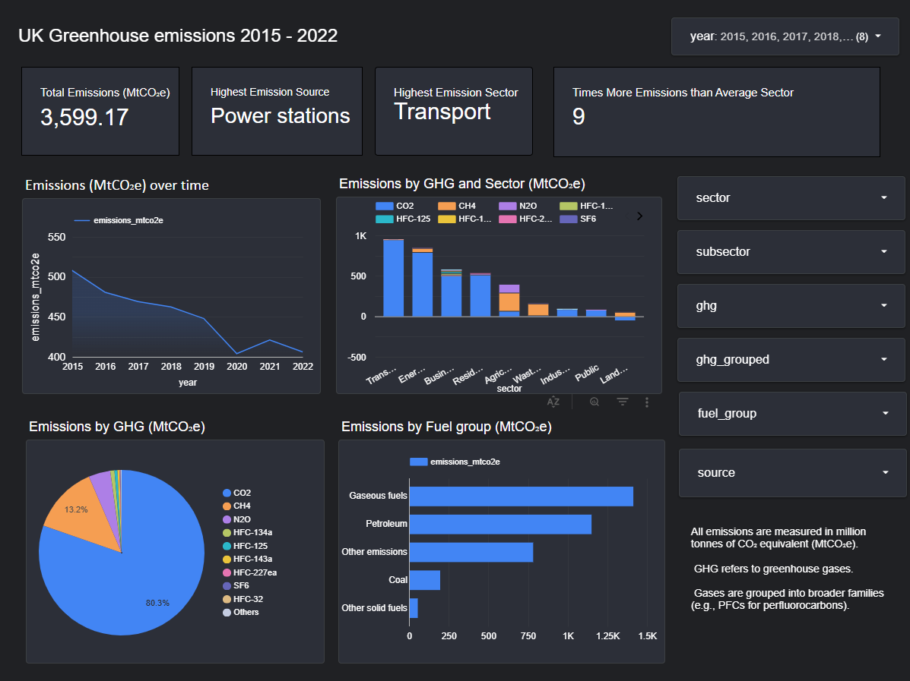
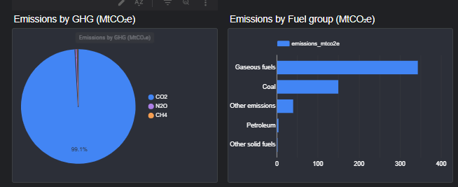

# UK Greenhouse emission dashboard 2015-2022

Background: 

This project is based on the UK Greenhouse gas emissions for

## Project Goals

- Analyse UK greenhouse gas emissions from 2015 to 2022 to identify major contributing sectors, sources, and fuel types.  
- Detect trends and anomalies over time, including the impact of external events such as COVID-19.  
- Assess data quality and highlight gaps in official reporting, particularly in subsector classification.  
- Build an interactive dashboard to make findings accessible for policy, environmental, and public use.  
- Apply data governance principles to ensure data accuracy, consistency, and reproducibility.

--- 
## Dashboard Screenshot 
- 

Check out the interactive dashboard on Looker Studio:  
[View Dashboard](https://lookerstudio.google.com/reporting/2defc0ea-6485-4813-a3a8-bca863a5b6b9)

----

## Dataset Summary

**Source:** UK Government National Atmospheric Emissions Inventory (public dataset)  
**Format:** Excel (cleaned and transformed in Google BigQuery using SQL)  
**Date Processed:** August 2025  
**Key Columns:**  
- **Date & Scope:** Year (2015–2022)  
- **Sector Classification:** National Communication Sector, National Communication Subsector  
- **Emissions Data:** Emissions (MtCO₂e)  
- **Source Details:** Emission Source, Fuel Group  
- **Greenhouse Gas:** GHG type, Grouped GHG category
  
----
## Tech Stack 

- **Google BigQuery (Cloud Data Warehouse): stored dataset, cleaned and transformed data using SQL**
- **SQL: performed data cleaning and transformation queries.**
- **Google Looker Studio: built an interactive dashboard for insights.**

- View the SQL queries used in [sql/](./sql/) 

----
## Data Governance & Data Cleaning

This project followed **data governance best practices** to ensure the dataset was accurate, consistent, and fit for analysis.  

Key steps included:

---

### 1. Data Quality Checks
- Queried the raw dataset to identify `NULL` values across all key fields:

```sql
SELECT 
  SUM(CASE WHEN Year IS NULL THEN 1 ELSE 0 END) AS year_nulls,
  SUM(CASE WHEN `National Communication Sector` IS NULL THEN 1 ELSE 0 END) AS sector_nulls,
  SUM(CASE WHEN `Emissions _MtCO2e_` IS NULL THEN 1 ELSE 0 END) AS emissions_nulls,
  SUM(CASE WHEN `National Communication Subsector` IS NULL THEN 1 ELSE 0 END) AS subsector_nulls,
  SUM(CASE WHEN Source IS NULL THEN 1 ELSE 0 END) AS source_nulls
FROM `arched-gear-440814-b0.carbon_emissions.uk_ghg_emissions_raw`;
```

- Counted `(blank)` placeholder values to assess completeness — found **~51.7% missing subsector data**:

```sql
SELECT 
  SUM(CASE WHEN `National Communication Subsector` = '(blank)' THEN 1 ELSE 0 END) AS subsector_blanks
FROM `arched-gear-440814-b0.carbon_emissions.uk_ghg_emissions_raw`;
```

---

### 2. Standardisation
- Replaced `(blank)` entries with `NULL` and assigned `"Unknown"` where appropriate:

```sql
COALESCE(NULLIF(`National Communication Sector`, '(blank)'), 'Unknown') AS sector,
COALESCE(NULLIF(`National Communication Subsector`, '(blank)'), 'Unknown') AS subsector
```

- Applied consistent field names for easier querying:
  - `year`, `sector`, `emissions_mtco2e`, `subsector`, `source`, `ghg`, `ghg_grouped`, `fuel_group`.

---

### 3. Scope Definition
- Filtered dataset to **2015–2022** to align with analysis goals:

```sql
WHERE Year BETWEEN 2015 AND 2022
```

---

### 4. Metadata & Documentation
- Documented all SQL cleaning and transformation steps in this README to ensure the process is **auditable** and **reproducible**.
- Maintained clear naming conventions for tables:
  - `uk_ghg_emissions_raw` - original imported dataset
  - `uk_ghg_emissions_clean` - cleaned and standardised dataset ready for analysis.

---

### 5. Compliance Considerations
- All data was sourced from publicly available UK government emissions statistics.
- No personally identifiable information (PII) was processed; GDPR compliance maintained.

---

### 6. Final Output
**SQL query to create cleaned table:**

```sql
CREATE OR REPLACE TABLE `arched-gear-440814-b0.carbon_emissions.uk_ghg_emissions_clean` AS
SELECT
  Year AS year,
  COALESCE(NULLIF(`National Communication Sector`, '(blank)'), 'Unknown') AS sector,
  `Emissions _MtCO2e_` AS emissions_mtco2e,
  COALESCE(NULLIF(`National Communication Subsector`, '(blank)'), 'Unknown') AS subsector,
  COALESCE(NULLIF(Source, '(blank)'), 'Unknown') AS source,
  COALESCE(NULLIF(GHG, '(blank)'), 'Unknown') AS ghg,
  COALESCE(NULLIF(`GHG Grouped`, '(blank)'), 'Unknown') AS ghg_grouped,
  COALESCE(NULLIF(`Fuel Group`, '(blank)'), 'Unknown') AS fuel_group
FROM 
  `arched-gear-440814-b0.carbon_emissions.uk_ghg_emissions_raw`
WHERE 
  Year BETWEEN 2015 AND 2022;
```

- Reduced dataset from **50,000+ rows** to **~15,000 rows** post-cleaning and filtering.
- Prepared dataset was then used for trend analysis, sector breakdowns, and dashboard visualisation in Looker Studio.

---- 

## Insights:

- Emissions have been declining since 2015, and there was also a sharp decline in 2020 due to COVID-19 halting production (lockdown, etc)  
- The decline since 2015 could show the UK’s leaning stance towards renewable energy and less on fossil fuels as they are producing fewer emissions.  
- Especially after 2021 there was a drop again could represent policy changes to adjust to the pandemic, as well as increased investment into renewable energy to meet the clean energy quotas  
- Power stations are the biggest source - electricity, etc, primarily due to electricity generation from fossil fuels, accounting for **over 99% of emissions in their category**.  
- **Identified ~51.7% missing subsector data**, highlighting a major gap in UK emissions reporting.  
- **Discovered transport as the highest-emitting sector (~9× average)**, indicating a critical area for targeted emissions reduction.  
- **Identified power stations as the top emission source (99.1% CO₂ in their greenhouse gas profile)**, revealing heavy fossil fuel reliance.  
-   
- Transport is the highest sector in terms of emissions in the UK and 9 times the average, making it a critical target for reduction policy.  
- The bar chart of the fuel groups shows that the UK is still heavily reliant on fossil fuels/non-renewable energy (gaseous fuels and petroleum)  
- Additionally, CH4, methane, is the second biggest contributor to global warming!
----

## Dashboard Features

**KPI Cards:**
- Total Emissions (MtCO₂e)
- Highest Emission Source
- Highest Emission Sector
- Times more emission than average sector 

**Interactive Filters:**
- Year range (2015–2022)
- Sector, subsector, and emission source
- Greenhouse gas type and grouped category
- Fuel group

**Visuals:**
- Line Chart: Emissions over time (MtCO₂e)
- Stacked Bar Chart: Emissions breakdown by GHG and Sector (MtCO₂e)
- Pie Chart: Greenhouse gas profile 
- Bar Chart: Fuel group distribution (renewable vs non-renewable)

**Interactivity:**
- Drill-down filters to explore emissions at sector → subsector → source level
- Cross-filtering between charts for deeper insights
  
----

## Limitations 

This analysis has several constraints. Scope 3 emissions, which are indirect greenhouse gas emissions that occur outside of its direct operations and energy consumption, are not fully captured. The dataset also excludes the carbon footprint of imported goods and services, as well as emissions generated by UK companies operating outside the UK. Furthermore, the ~51.7% missing data in the subsector field raises concerns about the completeness and accuracy of UK emissions reporting, potentially affecting the granularity and reliability of sector-level insights.

